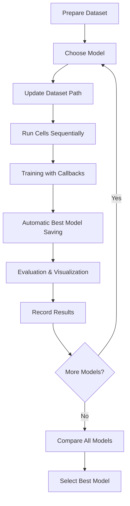

# Brain Tumor Classification Project - Brief

## 🎯 Objective
Develop a comprehensive deep learning solution for classifying brain tumor MRI images into four categories using multiple neural network architectures.

## 📊 Classification Categories
1. **Glioma Tumor**
2. **Meningioma Tumor**
3. **No Tumor**
4. **Pituitary Tumor**

## 🤖 Models Implemented
The project implements and compares **5 different deep learning models**:

| Model | Type | Key Feature |
|-------|------|-------------|
| **Custom CNN** | From scratch | 4-block architecture with 32→256 filters |
| **VGG16** | Transfer Learning | Deep 16-layer network pre-trained on ImageNet |
| **VGG19** | Transfer Learning | Deeper 19-layer variant of VGG |
| **MobileNet** | Transfer Learning | Lightweight, efficient mobile architecture |
| **ResNet50** | Transfer Learning | 50-layer residual network with skip connections |

## 🔧 Technical Specifications

### Configuration
- **Input Size**: 224×224 RGB images
- **Batch Size**: 32
- **Epochs**: 20 (with early stopping)
- **Validation Split**: 20% of training data

### Optimizer & Loss
- **Optimizer**: Adam (learning rate: 0.001)
- **Loss Function**: Categorical Crossentropy

### Data Augmentation
- Rotation: ±20°
- Width/Height Shift: 20%
- Shear Range: 20%
- Zoom Range: 20%
- Horizontal Flip: Enabled
- Pixel Normalization: Rescaling to [0, 1]

### Callbacks & Training Controls
1. **EarlyStopping**: Patience of 5 epochs on val_loss
2. **ModelCheckpoint**: Saves best model based on val_loss
3. **ReduceLROnPlateau**: Reduces LR by 50% after 3 plateau epochs

## 📈 Evaluation Metrics
Each model is evaluated using:
- ✅ **Accuracy** - Overall classification correctness
- ✅ **Precision** - Positive prediction accuracy
- ✅ **Recall** - True positive detection rate
- ✅ **F1 Score** - Harmonic mean of precision and recall
- ✅ **Confusion Matrix** - Visual error analysis
- ✅ **Classification Report** - Per-class performance breakdown

## 📦 Deliverables

### Code Files (Cell-Based Structure)
1. `brain_tumor_classification_cnn.py` - Custom CNN (13 cells, ~400 lines)
2. `brain_tumor_classification_vgg16.py` - VGG16 model (10 cells, ~280 lines)
3. `brain_tumor_classification_vgg19.py` - VGG19 model (10 cells, ~280 lines)
4. `brain_tumor_classification_mobilenet.py` - MobileNet model (10 cells, ~280 lines)
5. `brain_tumor_classification_resnet.py` - ResNet50 model (10 cells, ~280 lines)
6. `brain_tumor_models_comparison.py` - Performance comparison tool (5 cells)

### Documentation
7. `README.md` - Complete setup, usage, and troubleshooting guide
8. `PROJECT_BRIEF.md` - This document

## 🎨 Key Features

### Data Visualization
- Display 16 random training images with labels
- Display 16 random testing images with labels
- Sample predictions with confidence scores and color-coded accuracy

### Training Monitoring
- Real-time progress tracking
- 4-panel training history visualization:
  - Accuracy curves (train/validation)
  - Loss curves (train/validation)
  - Precision & Recall tracking
  - F1 Score progression

### Results Analysis
- Confusion matrix heatmaps
- Detailed classification reports
- Model comparison charts
- Best model identification

## 💻 Code Structure

Each model follows a **cell-based architecture** for Jupyter Notebook/Google Colab:

```
Cell 1:  Imports & Configuration
Cell 2:  Dataset Loading (⚠️ User updates path here)
Cell 3:  Data Preprocessing & Augmentation
Cell 4:  Custom Metrics (Precision, Recall, F1)
Cell 5:  Model Architecture Definition
Cell 6:  Callbacks Configuration
Cell 7:  Model Compilation & Training
Cell 8:  Training History Visualization
Cell 9:  Test Set Evaluation
Cell 10: Confusion Matrix & Classification Report
```

## 🔄 Workflow



## 📋 Dataset Requirements

**Expected Structure:**
```
dataset/
├── Training/
│   ├── glioma_tumor/
│   ├── meningioma_tumor/
│   ├── no_tumor/
│   └── pituitary_tumor/
└── Testing/
    ├── glioma_tumor/
    ├── meningioma_tumor/
    ├── no_tumor/
    └── pituitary_tumor/
```

## ✨ Design Philosophy

### Simplicity & Clarity
- **Cell-based structure**: Easy to understand and modify
- **Consistent patterns**: Same workflow across all models
- **Clear placeholders**: Dataset path marked with ⚠️ warnings

### Completeness
- **End-to-end pipeline**: From data loading to evaluation
- **Multiple architectures**: Compare custom vs. transfer learning
- **Professional metrics**: Industry-standard evaluation

### Flexibility
- **Easy customization**: Hyperparameters in configuration cell
- **Modular design**: Reusable metric functions
- **Platform agnostic**: Works in Jupyter, Colab, or as script

## 🎓 Use Cases

This project is ideal for:
- 🏥 **Medical imaging research**
- 📚 **Deep learning education** (comparing architectures)
- 🔬 **Transfer learning demonstrations**
- 🏆 **Kaggle competitions** (brain tumor classification)
- 💼 **Portfolio projects** (showcasing ML skills)

## 🚀 Getting Started

**3 Simple Steps:**
1. Install dependencies: `pip install tensorflow numpy matplotlib seaborn scikit-learn pandas`
2. Update `DATASET_PATH` in Cell 2 of any model file
3. Run cells sequentially in Jupyter/Colab

**Estimated Time:**
- Setup: 5 minutes
- Training per model: 6-15 minutes (depending on GPU)
- Total for all 5 models: ~1 hour

## 📊 Expected Outputs

### Per Model
- ✅ Trained model file (`.h5` format)
- ✅ Training history plots
- ✅ Test metrics (accuracy, precision, recall, F1)
- ✅ Confusion matrix visualization
- ✅ Classification report

### Overall
- ✅ Comparative analysis of all 5 models
- ✅ Best model identification
- ✅ Performance metrics comparison charts

## 🎯 Project Goals - Achieved ✅

- [x] Custom CNN model with full data visualization
- [x] 4 transfer learning models (VGG16, VGG19, MobileNet, ResNet50)
- [x] Data preprocessing with augmentation
- [x] IMG_SIZE=224, BATCH_SIZE=32 configuration
- [x] All metrics: accuracy, precision, recall, F1 score
- [x] Callbacks: EarlyStopping (patience=5), ModelCheckpoint, ReduceLROnPlateau
- [x] Adam optimizer with categorical crossentropy
- [x] Training for 20 epochs
- [x] Testing on new data
- [x] Comprehensive result visualization
- [x] Simple, cell-based code structure
- [x] Complete documentation

---

**Status**: ✅ **Complete and Ready to Use**

**Created**: December 2025  
**Language**: Python 3.x  
**Framework**: TensorFlow/Keras  
**License**: Educational Use
